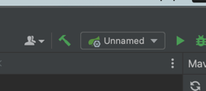

# Steps to run application

1. Run 'mvn clean install' in terminal.

2. Update database password in application.yaml file.

2. Verify run configurations.

3. Run application.

# Steps to run back end application in POSTMAN

1. Run register endpoint. Copy over a token

2. Post given token to test other endpoints

Postman documentation sample: https://documenter.getpostman.com/view/5828655/2s93XyUiLj#534cdfc9-9620-423b-822d-e0f13d5f95a4
